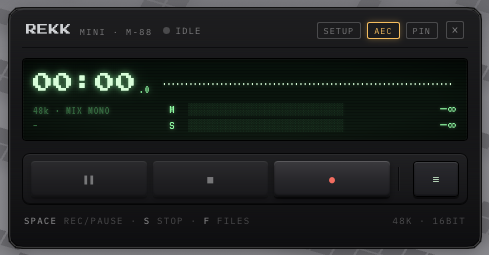
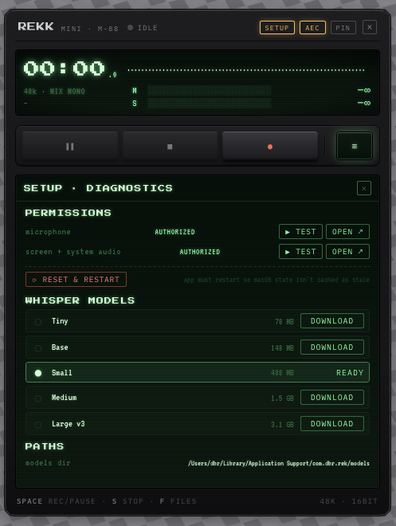

# Rekk

A tiny macOS audio recorder that captures your microphone **and** the system audio at the same time, cancels the speaker → mic echo with WebRTC AEC, and transcribes the result locally with [whisper.cpp](https://github.com/ggerganov/whisper.cpp). No cloud, no Python, no subscription.





## What it does

- **Mic + system audio in one WAV**. ScreenCaptureKit taps the system output natively; no virtual audio driver, no BlackHole / Loopback dance.
- **Acoustic Echo Cancellation** (WebRTC AudioProcessing). Record meetings on speakers without the doubled-voice effect.
- **Local transcription** via `whisper.cpp` with Metal acceleration. Models stay on disk under `~/Library/Application Support/io.dbr.rekk/models/`. Nothing leaves the machine.
- **Streaming segments**: transcript lines appear as Whisper decodes them, not at the end.
- **Compact LCD-handheld UI** that pins to a corner of your screen while you work.
- **Pause / resume**, per-source mute (mic / system), language selector (ES / EN / Auto), re-transcribe in another language at any time, files browser with `reveal in Finder`.

## Requirements

- macOS 11+ (Apple Silicon recommended; Metal backend kicks in there).
- About 600 MB free for the default `small` Whisper model (other sizes available from inside the app).
- Microphone permission and Screen & System Audio Recording permission (the app walks you through them under `setup`).

## Install

Download `Rekk_<version>_aarch64.dmg` from the [Releases](https://github.com/danibram/rekk/releases) page, open it, drag `Rekk.app` to `/Applications`.

The binary is **not** notarized — first launch will need a right-click → Open → Open to dismiss Gatekeeper, or `xattr -dr com.apple.quarantine /Applications/Rekk.app`.

## Build from source

```sh
# one-time toolchain (Homebrew)
brew install cmake meson ninja

# clone + run
git clone https://github.com/danibram/rekk
cd rekk
npm install
npm run tauri build     # → src-tauri/target/release/bundle/macos/Rekk.app
                        # → src-tauri/target/release/bundle/dmg/Rekk_*.dmg
```

The first build compiles `whisper.cpp` (with Metal) and `webrtc-audio-processing` from source — expect 2–4 minutes once, cached afterward.

For development hot-reload:

```sh
npm run tauri dev
```

## Architecture

```
┌────────────────────────────────────────────────────────────┐
│                          React UI                          │
│  topbar · LCD strip · controls · drawer (files/tx/setup)   │
└────────────────────────┬───────────────────────────────────┘
                         │  Tauri IPC (invoke + event)
                         ▼
┌────────────────────────────────────────────────────────────┐
│                       Rust backend                         │
│                                                            │
│  CPAL ─┐   ScreenCaptureKit ─┐                             │
│        │                     │                             │
│        ▼                     ▼                             │
│   mic stream ───► WebRTC AEC ◄── system audio              │
│                       │                                    │
│                       ▼                                    │
│                  mixed WAV file ───► whisper.cpp (Metal)   │
│                                              │             │
│                                              ▼             │
│                                       .txt transcript      │
└────────────────────────────────────────────────────────────┘
```

Key crates: [`cpal`](https://github.com/RustAudio/cpal), [`screencapturekit-rs`](https://github.com/doom-fish/screencapturekit-rs), [`webrtc-audio-processing`](https://github.com/tonarino/webrtc-audio-processing), [`whisper-rs`](https://github.com/tazz4843/whisper-rs), [`hound`](https://github.com/ruuda/hound) for WAV I/O, [`tauri`](https://tauri.app) v2 for the shell.

## macOS permissions

On first record Rekk prompts for:

- **Microphone** — captures your voice.
- **Screen & System Audio Recording** — required by ScreenCaptureKit to tap the audio. Rekk never reads pixels; if you only want to grant the *audio* sub-permission, see below.

### Granting only system-audio access (macOS 14.4+)

If you don't want Rekk to be able to see your screen, macOS 14.4 added a sub-permission specifically for this case. After the first prompt:

1. Open *System Settings → Privacy & Security → Screen & System Audio Recording*.
2. Scroll down to the **System Audio Recording Only** section.
3. Enable Rekk there and leave Rekk **disabled** in the upper "Screen & System Audio Recording" list.

A future migration to the [Core Audio Process Tap](https://developer.apple.com/documentation/CoreAudio/capturing-system-audio-with-core-audio-taps) API (`NSAudioCaptureUsageDescription`) would make this the default and skip the screen recording prompt entirely.

### Phantom permissions after a rebuild

Every rebuild produces a binary with a new ad-hoc code signature, which macOS treats as a different app. The toggle in System Settings stays on but TCC denies access. Rekk's `setup → reset & restart` button runs `tccutil reset` for the bundle id and relaunches the process so macOS re-prompts cleanly.

## Credits

- [Georgi Gerganov](https://github.com/ggerganov) for [whisper.cpp](https://github.com/ggerganov/whisper.cpp) and the GGML model format hosted on [huggingface.co/ggerganov/whisper.cpp](https://huggingface.co/ggerganov/whisper.cpp).
- The WebRTC team for the [AudioProcessing](https://webrtc.googlesource.com/src/+/refs/heads/main/modules/audio_processing/) module, repackaged by PulseAudio and then by [tonarino](https://github.com/tonarino) for Rust.
- [doom-fish/screencapturekit-rs](https://github.com/doom-fish/screencapturekit-rs) for the safe Rust bindings to ScreenCaptureKit.
- [tazz4843/whisper-rs](https://github.com/tazz4843/whisper-rs) for the whisper.cpp bindings.
- The [Tauri](https://tauri.app) project for the shell.

## License

[MIT](./LICENSE) · © 2026 [danibram](https://github.com/danibram)
